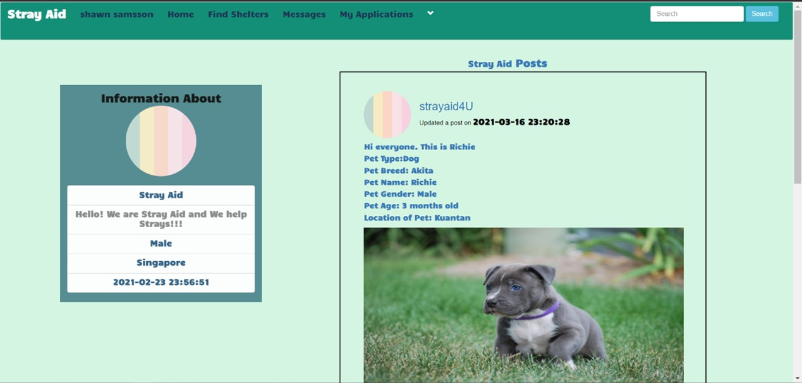

# Stray-Aid
This is a Final Year Project completed by me and my 2 other teammates, Dav and Shawn. Huge thanks to them for constantly guiding and helping me with my parts.

## Overview
Stray Aid is a animal adoption website that mimics a social networking site for shelters and animal lovers/volunteers to engage with each other with the purpose of providing a new home to the strays. 

The website consists of two users, with functions including:
```
NORMAL USERS (client)
  * Browse stray animal postings
  * View, edit account profile
  * Search shelters by name / post content / location
  * Submit and delete animal adoption application form
  * Message other users
  
SHELTERS (admin)
  * Publish stray animal postings
  * View, edit, delete postings
  * View, edit account profile
  * Search users by name / location
  * View animal adoption application form
  * Message other users
```

## Screenshots
1. Register/Log In Page


1.1 Forgot Password


1.2 Change Password


2. Browse Feed (Normal Users)


2.1 Publish Stray Animal Postings (Shelters)


2.1.1 Edit/View/Delete Animal Postings (Shelters)


3. Search by name/post content/location


4. View shelters profile


4.1 View and Edit profile


5. Message users


6. View Animal Adoption Application Form


--- The end! Thanks for reading me :) ---
